# Hackathon Quest Progress

## Reliability
### 🥉 Tier 1: Bronze

| Objective | Status | Notes |
|-----------|--------|-------|
| Write unit tests with pytest | ✅ Done | 97 unit + system tests across health, users, urls, events, and metrics |
| Set up GitHub Actions CI | ✅ Done | `.github/workflows/ci.yml` — runs on every push/PR |
| `GET /health` endpoint returns 200 | ✅ Done | `http://localhost:8080/health` |

#### Verification  
Screenshot of `GET /health` returning 200:  
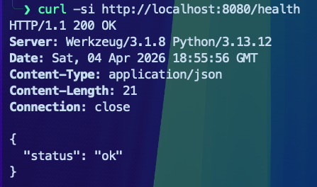  

Screenshot of Github Action CI with passing tests:  
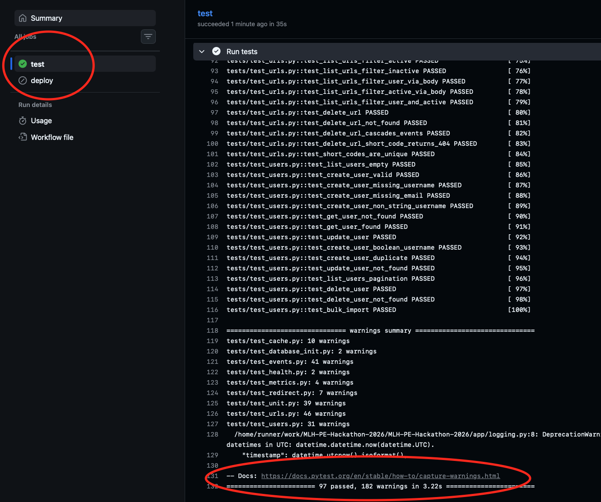  

### 🥈 Tier 2: Silver

| Objective | Status | Notes |
|-----------|--------|-------|
| 50% Coverage: Use pytest-cov | ✅ Done | `pytest-cov` added to dev dependencies |
| Integration Testing: Write tests that hit the API | ✅ Done | System tests use Flask `test_client()` against a real DB |
| The Gatekeeper: CI fails if tests fail | ✅ Done | See below |
| Error Handling: Document how app handles 404s and 500s | ✅ Done | [See API documentation](api.md) |

#### Verification  
Screenshot of 50% Coverage:  
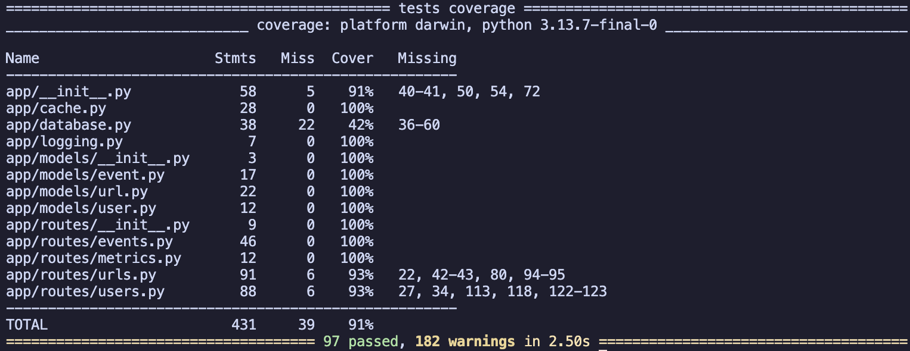 

Screenshots of deploy workflow dependency and failed test commits:  
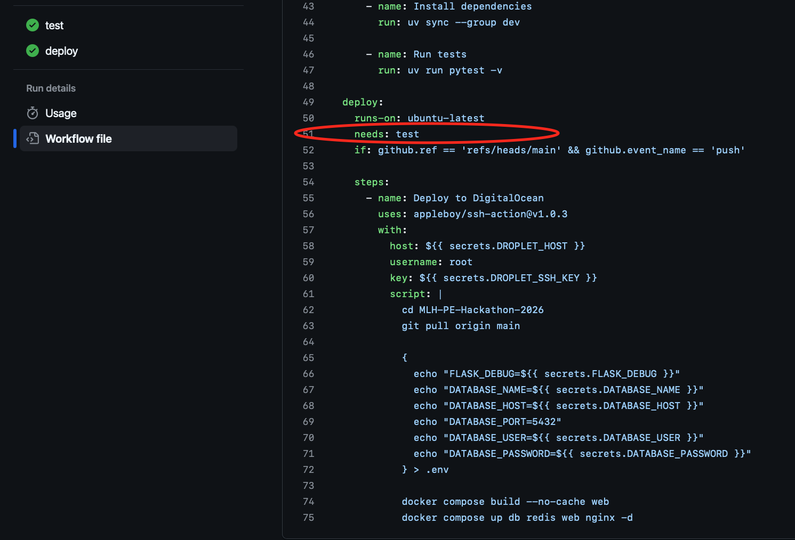  
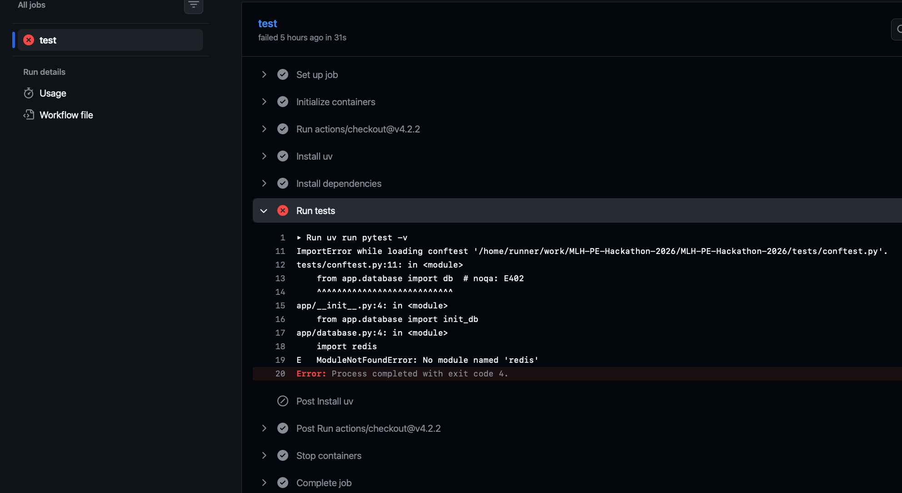. 
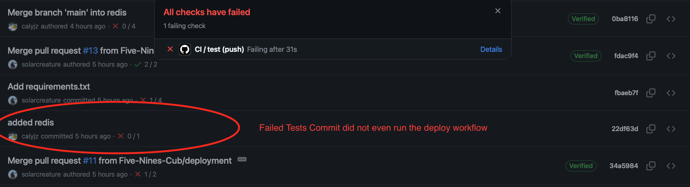. 

### 🥇 Tier 3: Gold

| Objective | Status | Notes |
|-----------|--------|-------|
| 70% Coverage: Use pytest-cov | ✅ Done | See image below |
| Graceful failure | ✅ Done | Live demo against prod (See below) |
| Restarts automatically when app process or container is killed | ✅ Done | `restart: on-failure` in docker-compose.yml — kills both containers with `kill -9`, restarts within seconds |
| Create failure manual and document exactly what happens when things break | ✅ Done | [Failure Manual](./failure_manual.md) |

#### Verification  
Screenshot of 70% Coverage:  
  

#### Graceful Failure — Live Demo

A script was run against the production server (`http://64.23.146.45:8080`) sending 9 bad inputs. Every case returned a clean JSON `{"error": "..."}` response with an appropriate 4xx status code — no crashes, no HTML stack traces.

**Tests run:**

| # | Input | Expected Status | What it verifies |
|---|-------|-----------------|------------------|
| 1 | `POST /urls/` with empty `{}` body | 422 | Missing required fields returns validation error |
| 2 | `POST /urls/` with `"this is not json"` body | 422 | Malformed / non-JSON body does not crash the app |
| 3 | `POST /urls/` with `user_id: 99999` (non-existent) | 404 | Reference to missing resource returns 404 JSON |
| 4 | `POST /users/` with `username: 123` (number) | 422 | Wrong field type returns validation error |
| 5 | `POST /users/` with no `email` field | 422 | Missing field returns validation error |
| 6 | `GET /users/99999` | 404 | Non-existent user returns 404 JSON |
| 7 | `GET /urls/99999` | 404 | Non-existent URL returns 404 JSON |
| 8 | `GET /nonexistentcode` | 404 | Unknown short code returns 404 JSON |
| 9 | `GET /totally/fake/route` | 404 | Unknown route returns 404 JSON |

Live demo video:  
https://github.com/user-attachments/assets/9ea2292a-210b-4ac5-ab4c-8919ee41c6fe


---

## Scalability
### 🥉 Tier 1: Bronze

| Objective | Status | Notes |
|-----------|--------|-------|
| Set up k6 or Locust for load testing | ✅ Done | [See load_test_k6.js](../load_test_k6.js) |
| Simulate 50 concurrent users hitting your service | ✅ Done | See image below |
| Document your Response Time (Latency) and Error Rate | ✅ Done | see image below |

#### Verification  
Screenshot of terminal output showing 50 concurrent users:  
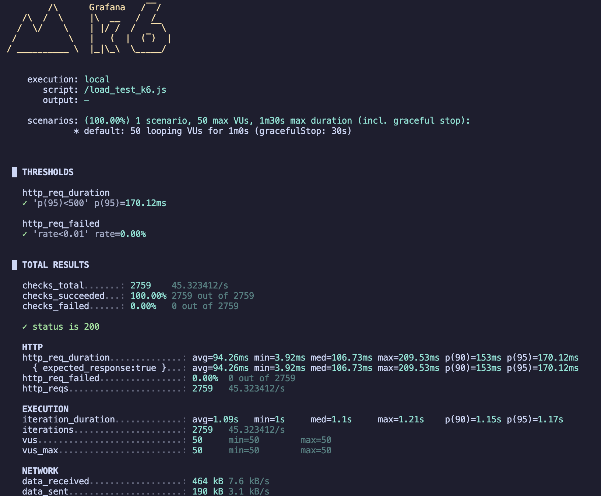

Documented baseline p95 response time:  
```
  █ THRESHOLDS 

    http_req_duration
    ✓ 'p(95)<500' p(95)=193.88ms

    http_req_failed
    ✓ 'rate<0.01' rate=0.00%
```

### 🥈 Tier 2: Silver

| Objective | Status | Notes |
|-----------|--------|-------|
| 200 concurrent users for load testing | ✅ Done | View how to set the number of users [here](../README.md#load-tests) |
| Run 2+ instances of your app (containers) using Docker Compose | ✅ Done | View how to set the number of instances [here](../README.md#starting-the-docker-container) |
| Put a Load Balancer (Nginx) in front to split traffic between instances | ✅ Done | [Config file](../nginx.conf) |
| Keep response times under 3 seconds | ✅ Done | See image below |

#### Verification  
Screenshot of terminal output showing 200 concurrent users with 2 instances and a load balancer:  
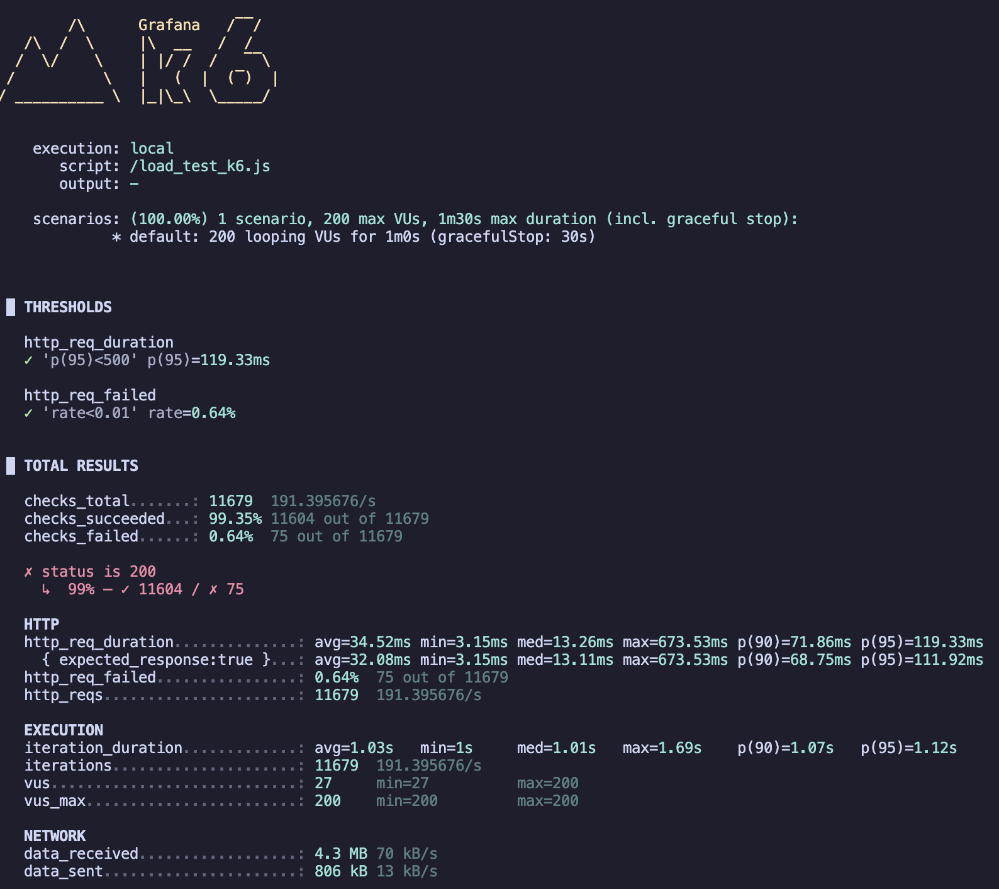

Screenshot of terminal output showing 2 docker containers and nginx container:  
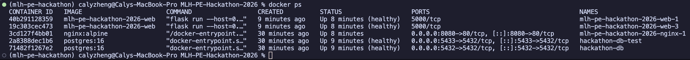

### 🥇 Tier 3: Gold

| Objective | Status | Notes |
|-----------|--------|-------|
| Handle 500+ concurrent users (or 100 req/sec) | ✅ Done | 381 req/s See k6 load test results screenshot  |
| Implement Redis | ✅ Done | config is in [docker-compose.yml](../docker-compose.yml), set/get/delete operations in [app/cache.py](../app/cache.py)|
| Identifying Bottlenecks | ✅ Done | See bottleneck report below |
| Error rate must stay under 5% | ✅ Done | 0% error rate (See below) |

#### Verification  
Evidence of caching:  
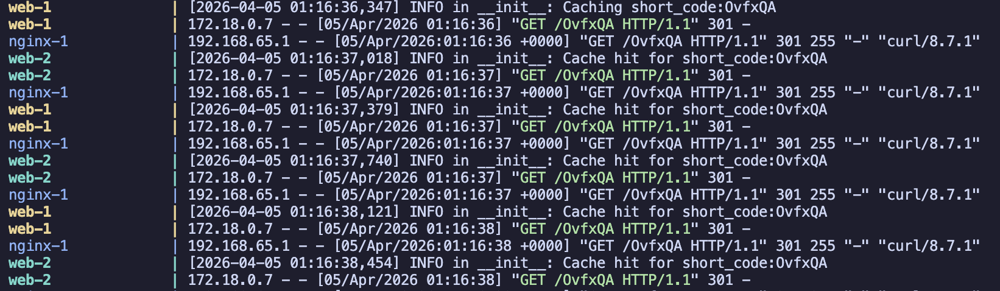   

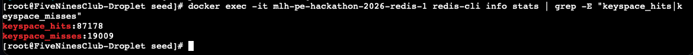   

Screenshot of terminal output showing 500+ concurrent users:  
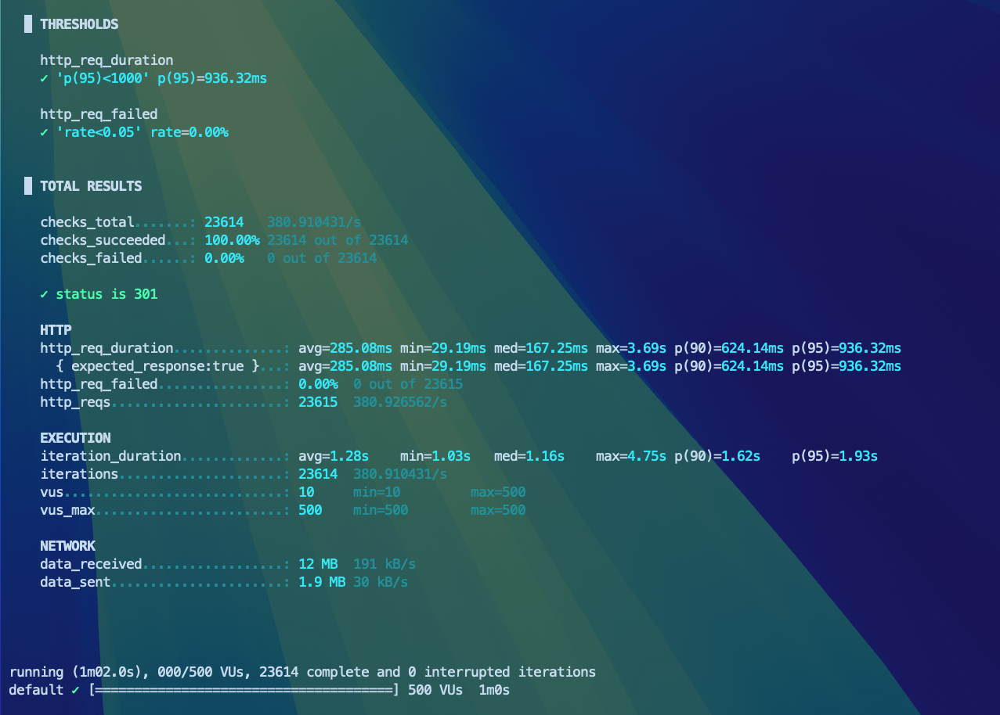

Error Rate from above screenshot:
```
   █ THRESHOLDS

    http_req_duration
    ✓ 'p(95)<1000' p(95)=936.32ms

    http_req_failed
    ✓ 'rate<0.05' rate=0.00%


  █ TOTAL RESULTS

    checks_total.......: 23614   380.910431/s
    checks_succeeded...: 100.00% 23614 out of 23614
    checks_failed......: 0.00%   0 out of 23614
```

Bottleneck Report:

We ran `docker stats` to identify which parts of the system were under the most stress. The image below was taken from a 500+ concurrent user run with 2 web server instances and a nginx load balancer. From the image below, we can see that the database's CPU exceeds 100% and the web-server's CPU each exceeding past 90%, meaning that these are likely the source of our bottleneck.

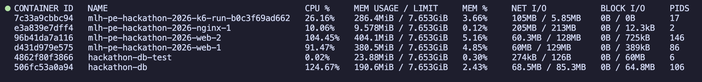

We also took a deeper look into the traffic routing with Nginx. The image below shows Nginx routing all traffic to a single container (` mlh-pe-hackathon-2026-web-1`) due to incorrect load balancing configuration — Nginx cached the DNS resolution at startup and never re-resolved it, effectively ignoring the second replica entirely.

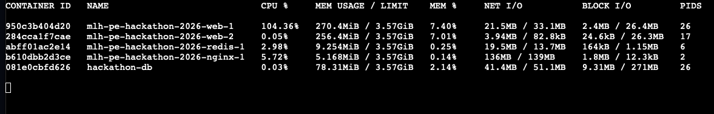

We made the following changes and saw the following results:  
| Iteration | Change | Error Rate | p95 |
|-----------|--------|------------|-----|
| Baseline | Flask dev server, 2 replicas | 43.62% | 4.62s |
| +Gunicorn (sync, 2 workers) | Switched from `flask run` to gunicorn | ~43% | ~4.5s |
| +Redis TTL 300s | Increased cache TTL from 60s → 300s | ~38% | ~4s |
| +Nginx tuning | `worker_processes auto`, keepalive, 1024 connections | ~25% | ~2s |
| +Gunicorn gthread (4 workers × 4 threads) | Replaced gevent (conflicted with Peewee) with gthread | 20.02% | 658ms |
| +DB connection pooling (max 32) | `PooledPostgresqlDatabase` via Peewee playhouse | 2.60% | 769ms |
| +Nginx load balancing fix | Forced nginx restart on deploy to re-resolve Docker DNS | 0.00% | 936ms |

**Identified Bottlenecks:**

1. **Database connections (primary)** — Each request opened a new Postgres connection. At 500 VUs this saturated the DB. We fixed the cap on  `PooledPostgresqlDatabase` connections at 32, shared across workers, which resulted in the biggest improvement

2. **Flask dev server** — `flask run` is single-threaded and not production-grade. Replaced with Gunicorn (`gthread` worker class). `gevent` was also tested but caused conflicts with Peewee's synchronous psycopg2 driver.

3. **Nginx connection limits** — Default nginx config had no `worker_connections` limit set, which caused connection queuing. Added `worker_processes auto` and `worker_connections 1024` with upstream keepalive.

4. **Cache TTL too short** — Redis TTL of 60s caused frequent cache misses under load, pushing traffic back to the DB. We increased to 300s and saw better performance.

5. **Nginx DNS caching (root cause of load imbalance)** — Nginx resolved `web` to a single container IP at startup and stuck to it, sending 100% of traffic to one replica. Fixed by forcing a full nginx restart on every CI deploy so it re-resolves Docker DNS and picks up all container IPs. This eliminated the remaining 2.6% error rate we initally got. The final error rate is 0.00%.


---

## Observability
### 🥉 Tier 1: Bronze

| Objective | Status | Notes |
|-----------|--------|-------|
| Configure JSON logs | ✅ Done | [logger configuration](../app/logging.py) |
| Expose a /metrics endpoint showing CPU/RAM usage | ✅ Done | [metrics endpoint](../app/routes/metrics.py) |
| Have a way to view logs without SSH-ing into the server. | ✅ Done | Fluent Bit ships logs to Better Stack — viewable at betterstack.com |

#### Verification  
JSON logs:  
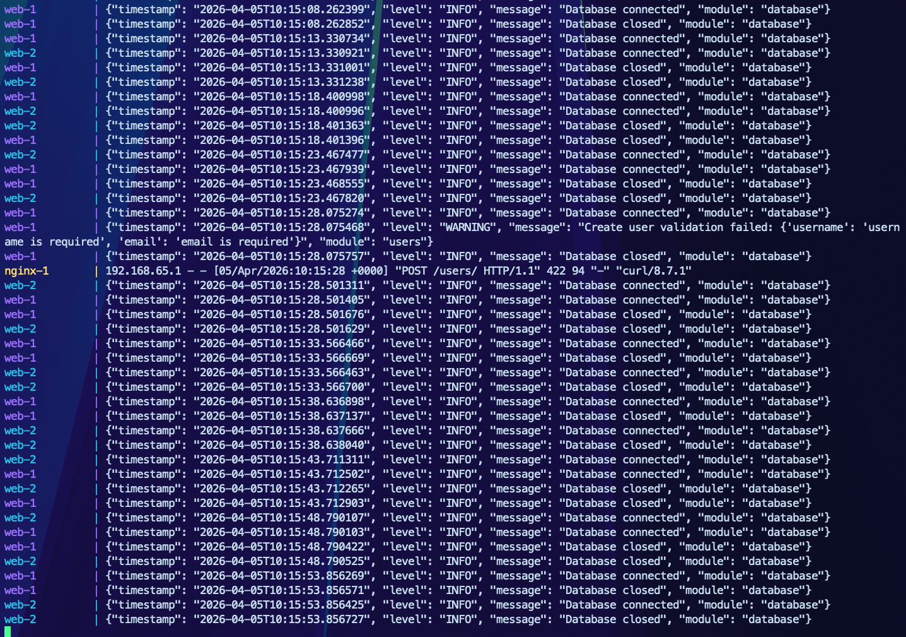

Metrics endpoint:  
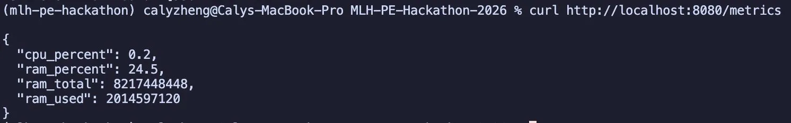  

External Logs (BetterStack):
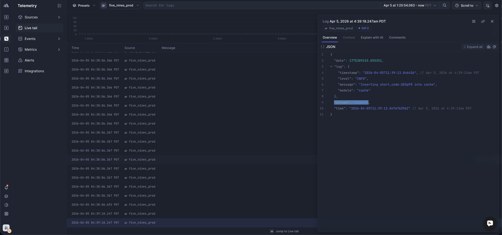  

### 🥈 Tier 2: Silver

| Objective | Status | Notes |
|-----------|--------|-------|
| Configure alerts for "Service Down" and "High Error Rate" | ✅ Done | Uptime monitor + log alert in Better Stack (see config below) |
| Connect alerts to a channel (Slack, Discord, Email) | ✅ Done | E-mail alerts configured for the team |
| Alert must fire within 5 minutes of failure | ✅ Done | Service Down: ~3 min, High Error Rate: ~1-2 min |

#### Verification

Service Down Monitor:
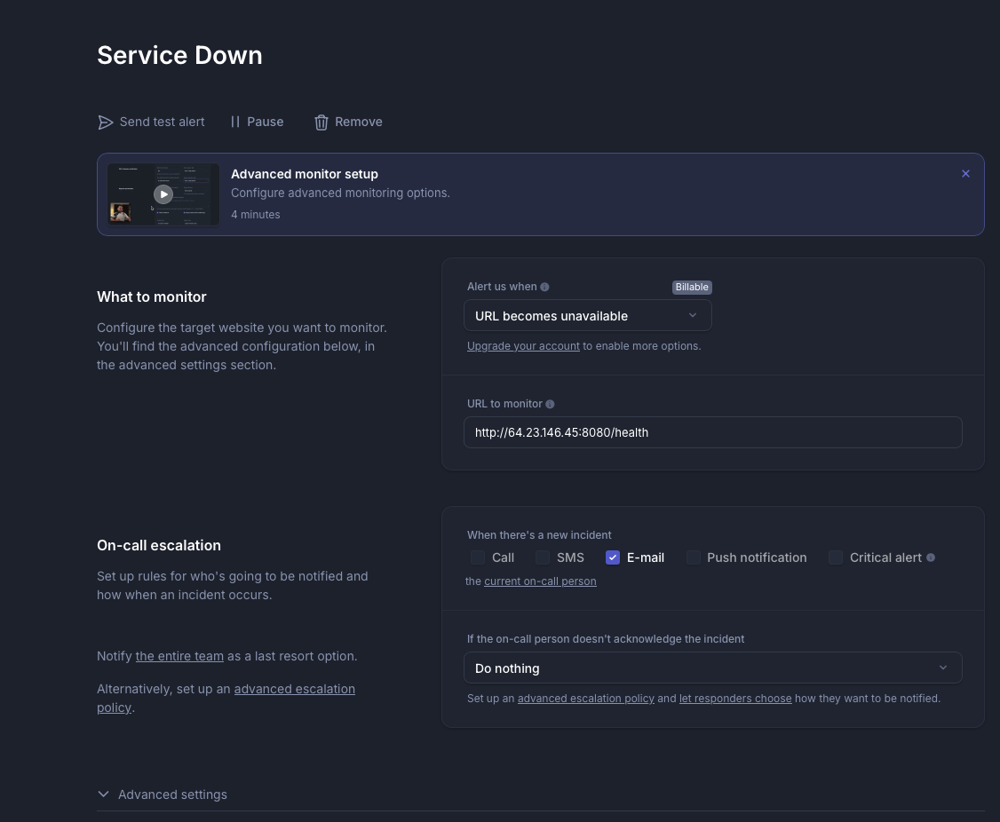
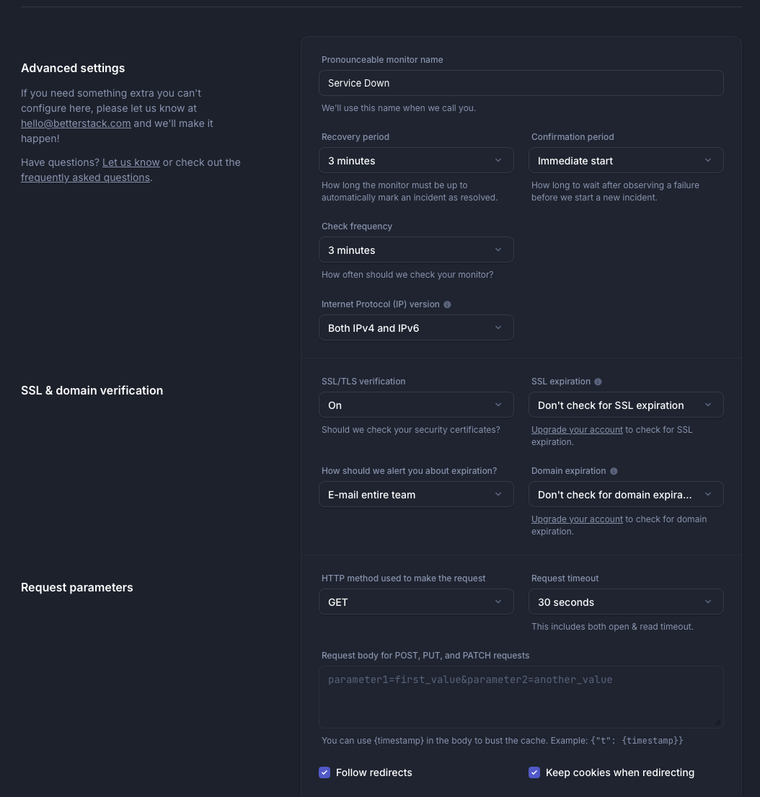

High Error Rate Alert:
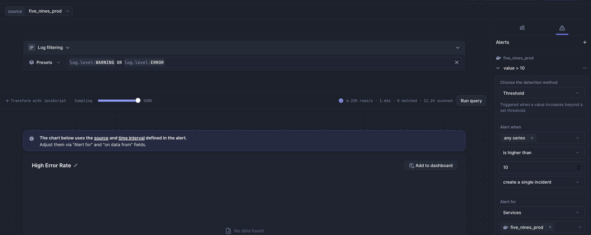
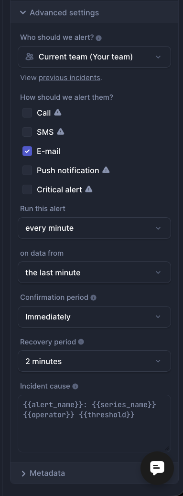

#### Alert Configuration
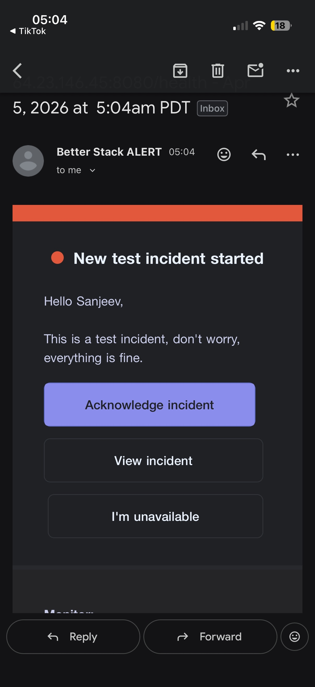

**Service Down** — Better Stack Uptime Monitor:
```yaml
monitor:
  name: Service Down
  url: http://64.23.146.45:8080/health
  alert_when: url_becomes_unavailable
  check_frequency: 3 minutes
  confirmation_period: immediate
  recovery_period: 3 minutes
  notification:
    channel: email
    team: Current team
```

**High Error Rate** — Better Stack Log Alert:
```yaml
alert:
  name: High Error Rate
  source: five_nines_prod
  query: "log.level:WARNING OR log.level:ERROR"
  detection_method: threshold
  condition: count > 10
  run_every: 1 minute
  on_data_from: last 1 minute
  confirmation_period: immediately
  recovery_period: 2 minutes
  notification:
    channel: email
    team: Current team
```

### 🥇 Tier 3: Gold

| Objective | Status | Notes |
|-----------|--------|-------|
| Build a visual dashboard tracking 4+ metrics (Latency, Traffic, Errors, Saturation) | ✅ Done | Grafana dashboard with 5 panels — Traffic, Error Rate, Latency p50/p95/p99, CPU, RAM |
| Write a runbook — "In Case of Emergency" guide | ✅ Done | [service-down.md](runbooks/service-down.md) and [high-error-rate.md](runbooks/high-error-rate.md) |
| Diagnose a fake issue using only the dashboard and logs | ✅ Done | See incident walkthrough below |

#### Verification
Grafana Dashboard:  
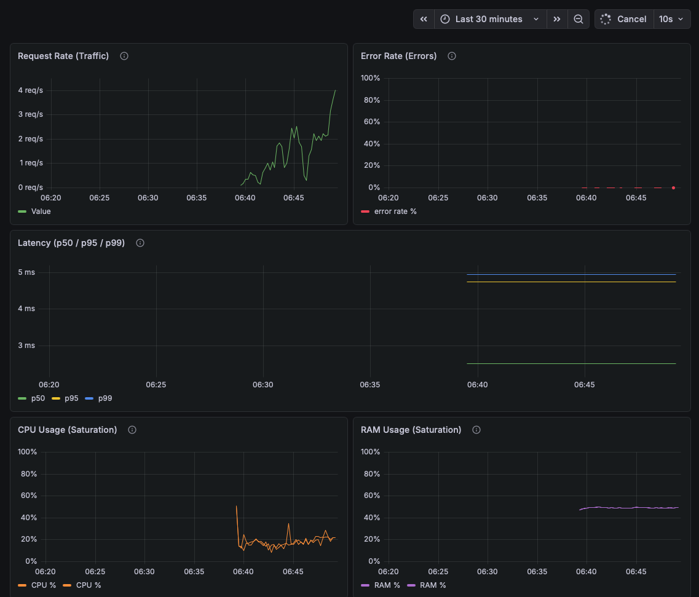

#### Fake Issue — High Error Rate Incident Walkthrough

**Setup:** We ran [test_bad_inputs.sh](../test_bad_inputs.sh) against production, which fires 60+ parallel bad requests (404s and 422s) in a single burst to simulate a spike in client errors.

**Step 1 — Alert fires**

Better Stack detected the spike at **8:19am PDT** and sent an email alert within 1 minute. The alert showed:
- **Cause:** Value > 10 (threshold)
- **Source:** five_nines_prod
- **Current value:** 84 warnings in the last minute

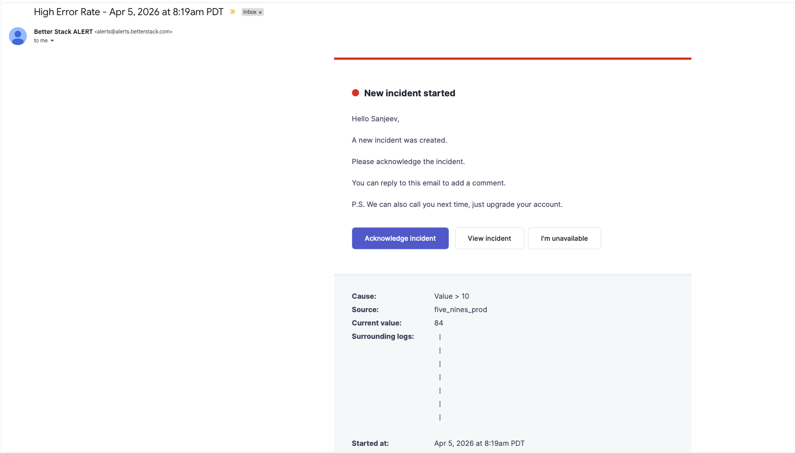

**Step 2 — Acknowledge the incident**

The incident was acknowledged immediately via email:

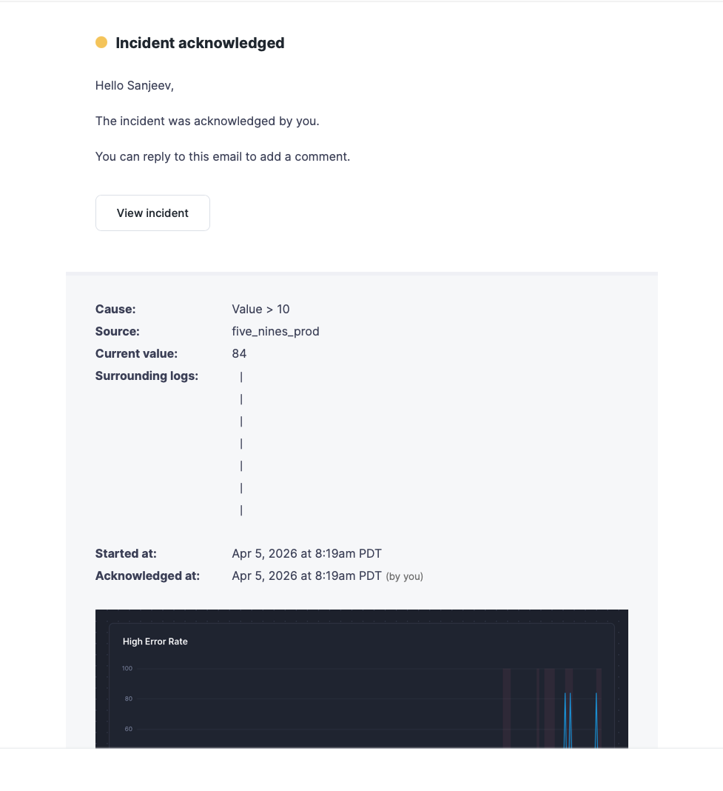

**Step 3 — Check the alert chart**

The Better Stack alert chart showed the large spike **after 8:00am PDT** — the smaller spikes before 8am were earlier test runs that stayed below the threshold. The post-8am spike crossed the alert threshold of 10 and triggered the incident:

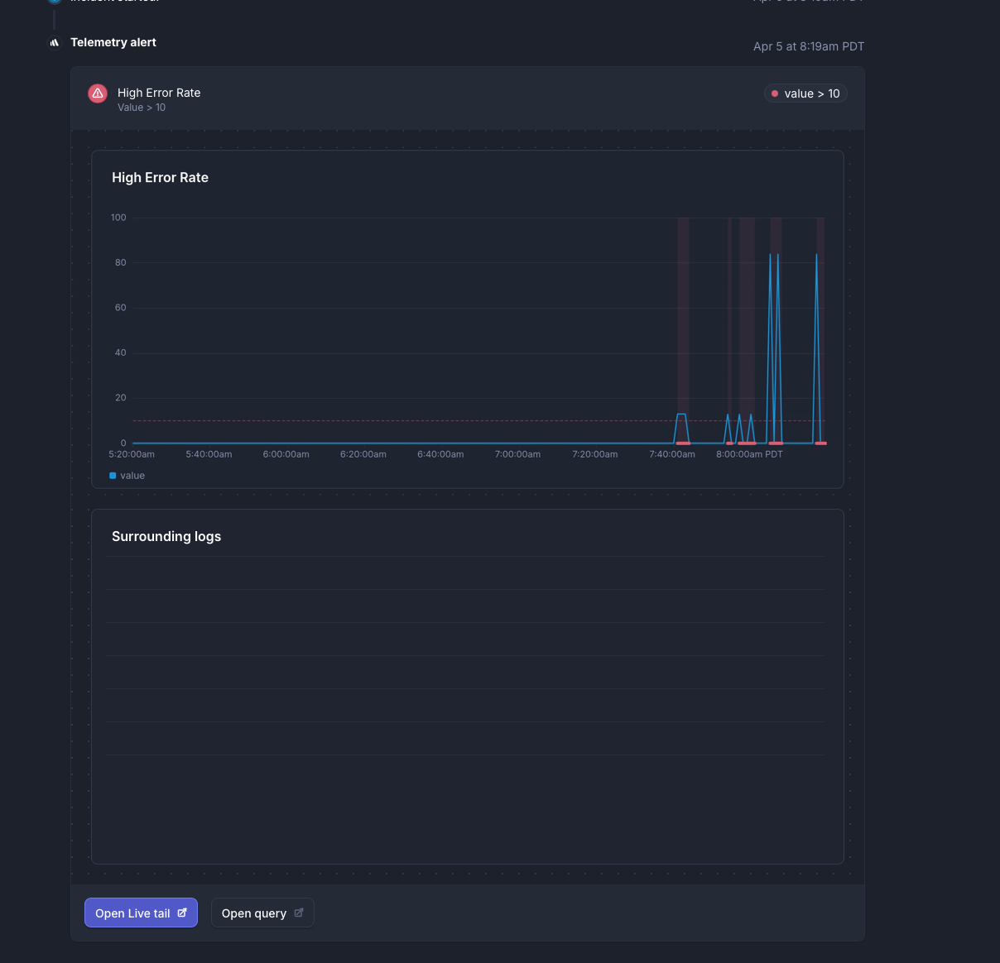

**Step 4 — Inspect logs in Better Stack**

Filtered logs by `log.level:WARNING OR log.level:ERROR`. Every entry showed `"message": "User not found: 99999"` — confirming the errors were all 404s from bad request IDs, not a real system failure:

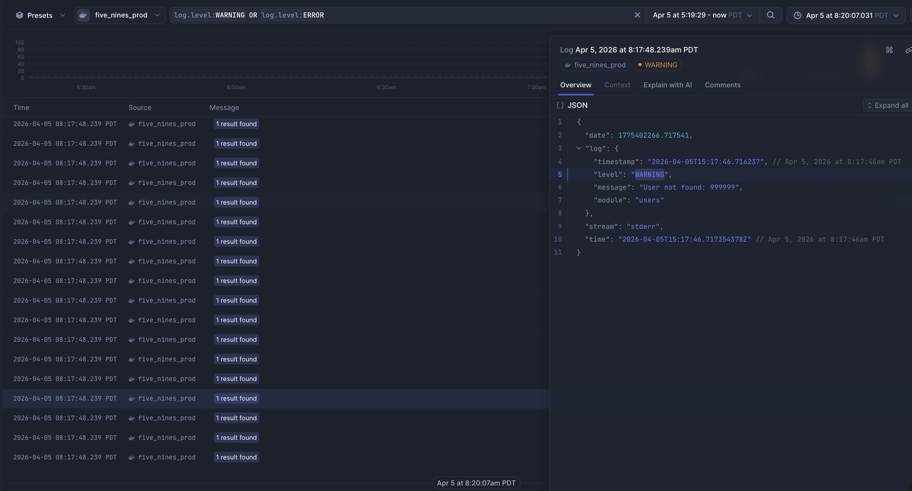

**Step 5 — Cross-reference in Grafana**

Grafana's Error Rate panel confirmed the spike correlating with the burst of bad requests. Traffic, Latency, CPU, and RAM remained stable — ruling out an infrastructure issue:

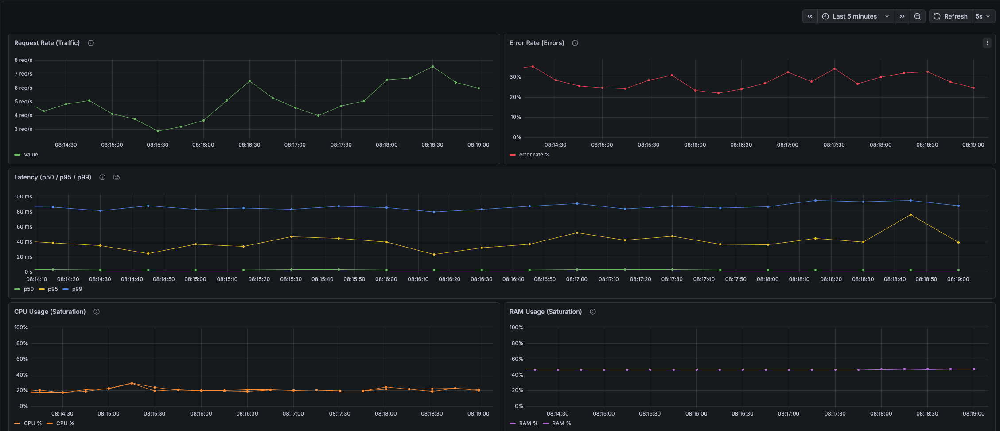

**Step 6 — Incident auto-resolves**

Once the script finished, error count dropped back below 10/min. Better Stack auto-resolved the incident after 47 seconds:

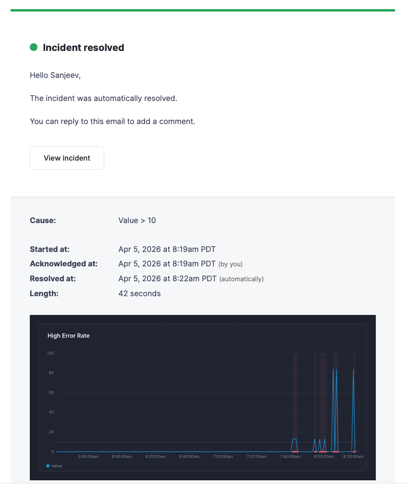

**Conclusion:** Using only the dashboard and logs (no SSH), we identified that the spike was caused by 84 invalid requests hitting non-existent user IDs in under a minute — not a system fault. The service remained healthy throughout.


---

## Documentation
### 🥉 Tier 1: Bronze

| Objective | Status | Notes |
|-----------|--------|-------|
| Setup instructions in README.md | ✅ Done | [README.md](../README.md) |
| Architecture diagram | ✅ Done | [architecture.md](architecture.md) |
| API documentation | ✅ Done | [api.md](api.md) |

### 🥈 Tier 2: Silver

| Objective | Status | Notes |
|-----------|--------|-------|
| Deployment guide | ✅ Done | [deploy.md](deploy.md) |
| Troubleshooting | ✅ Done | [troubleshooting.md](troubleshooting.md) |
| Config with environment variables | ✅ Done | [config.md](config.md) |

### 🥇 Tier 3: Gold

| Objective | Status | Notes |
|-----------|--------|-------|
| Runbooks | ✅ Done | [/runbooks/high-error-rate.md](/runbooks/high-error-rate.md) and [/runbooks/service-down.md](/runbooks/service-down.md) |
| Decision Lob | ✅ Done | [decisions.md](decisions.md) |
| Capacity plan | ✅ Done | [capacity.md](capacity.md) |
