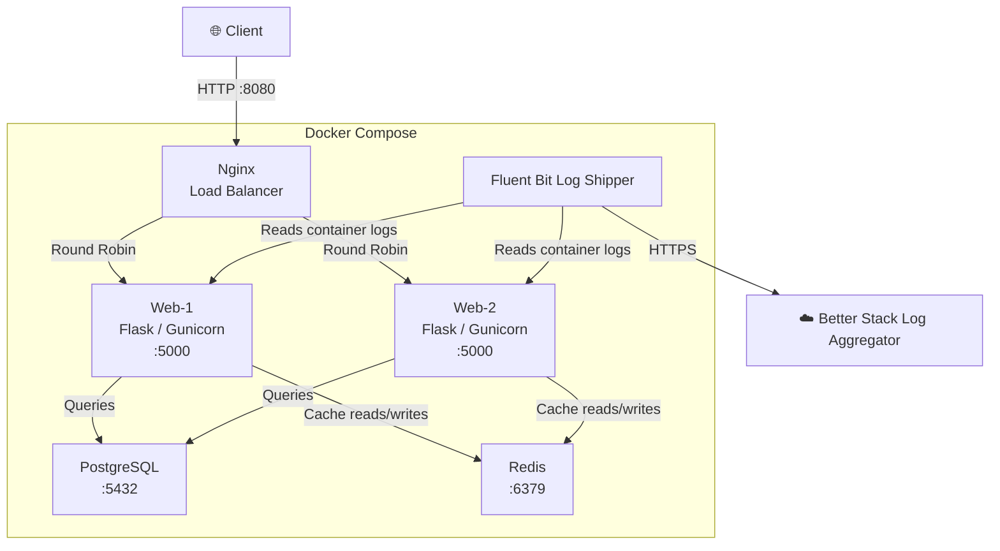

```mermaid
graph TD
    Client["🌐 Client"] -->|HTTP :8080| Nginx["Nginx\nLoad Balancer"]

    Nginx -->|Round Robin| Web1["Web-1\nFlask / Gunicorn\n:5000"]
    Nginx -->|Round Robin| Web2["Web-2\nFlask / Gunicorn\n:5000"]

    Web1 & Web2 -->|Queries| PG["PostgreSQL\n:5432"]
    Web1 & Web2 -->|Cache reads/writes| Redis["Redis\n:6379"]

    FluentBit["Fluent Bit Log Shipper"] -->|Reads container logs| Web1 & Web2
    FluentBit -->|HTTPS| BetterStack["☁️ Better Stack Log Aggregator"]

    subgraph Docker Compose
        Nginx
        Web1
        Web2
        PG
        Redis
        FluentBit
    end
```